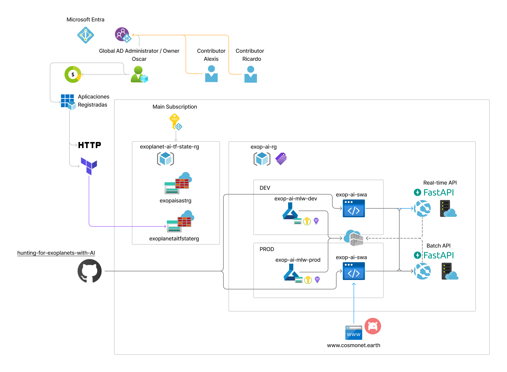

<div align="center">

# 🔭 Exoplanet AI: Hunting for Exoplanets with AI

AI/ML pipeline & web interface for the 2025 NASA Space Apps Challenge – automated exoplanet classification from Kepler / K2 / TESS open datasets.

</div>

## Overview
Thousands of exoplanets have been discovered via space-based survey missions. Much of the classification work has historically been manual. This repository provides a reproducible scaffold to:

* Ingest (sample) public NASA Exoplanet Archive data
* Train baseline ML models (optional LightGBM / CatBoost, Ensamble) and a DL Ensamble, a replica of [ExoMiner](https://arxiv.org/pdf/2111.10009)
* Serve predictions via a FastAPI service
* Offer a modern React SPA (Vite + Tailwind + shadcn-ui) for exploration, with legacy Streamlit/Gradio prototypes for rapid experimentation
* Prepare space for advanced preprocessing, feature engineering, model selection & evaluation

## Data flow architecture


*This modular pipeline ingests exoplanet data, preprocesses and engineers features, trains and evaluates ML models, and serves predictions via a FastAPI backend. The architecture supports both a React SPA and legacy UIs, with infrastructure managed by Docker and Terraform for scalable Azure deployment.  
Repository organization enables easy extension for advanced ML and cloud automation.*

## High-Level Architecture


## High-Level Project
```
configs/                # data/model/train/evaluate/web knobs
data/                   # raw/interim/processed storage (lightweight samples)
docs/                   # deep-dive documentation (overview, datasets, api, ui)
experiments/            # run snapshots, metrics
infra/                  # docker, terraform (AML), AML templates, k8s skeleton
models/                 # versioned model bundles (tracked metadata)
notebooks/              # exploratory analyses (00-04)
scripts/                # CLI entrypoints (fetch/train/evaluate/batch)
src/exoplanet_ai/
	api/                  # FastAPI app
	data/                 # download/load utilities
	features/             # feature engineering helpers
	preprocessing/        # sklearn pipelines
	models/               # registry + training abstractions
	training/             # orchestration & callbacks
	inference/            # batch predict + schemas
	evaluation/           # metrics, reporting, thresholds
	ui/                   # Streamlit app (legacy prototype)
	viz/                  # Plotly charts
	utils/                # logging, path helpers
tests/                  # pytest suites (data, features, api, cli)
web/                    # FastAPI mount, React SPA (web/site), legacy demos
```

## Quick Start

### 1. Environment
Requires Python 3.10+.

```pwsh
python -m venv .venv
./.venv/Scripts/Activate.ps1
pip install -U pip
# Full toolchain (training + API + dev tooling)
pip install -e .[train,api,dev]
```

> Need a lighter install? Use `pip install -e .[api]` for the FastAPI service or `pip install -e .[train]` for experimentation jobs.

### 2. Fetch Sample Data
```pwsh
python scripts/fetch_data.py
```
This pulls a small subset (top 500 rows) of the NASA Exoplanet Archive composite parameters table (for hackathon iteration speed).

### 3. Train Baseline
```pwsh
python scripts/train_model.py
```
Logs a simple classification report and saves the model in `models/`.

### 4. Run API
```pwsh
python scripts/run_api.py
```
Visit: http://localhost:8000/docs for interactive Swagger UI.

### 5. React Web App
```pwsh
cd web/site
npm install
cp .env.example .env.local  # ensure VITE_API_BASE_URL is set
npm run dev
```
The dev server runs at <http://localhost:5173>. Point `VITE_API_BASE_URL` to the FastAPI service (default `http://localhost:8000`).

### Optional: Streamlit UI
```pwsh
streamlit run src/exoplanet_ai/ui/app.py
```

### Optional: Gradio UI
```pwsh
python web/ui/gradio_app.py
```

### Optional: Lightkurve Sample
```pwsh
python -c "from exoplanet_ai.data.lightcurve import download_lightcurve; download_lightcurve('Kepler-10')"
```

### Optional: Export ONNX
```pwsh
make onnx
```

### Deploy: Terraform + Azure Machine Learning + Static Web App
```pwsh
cd infra/terraform
terraform init
terraform plan -var="project_name=exo-ai" -var="acr_name=exoacr" -var="storage_account_name=<unique storage>"
terraform apply
```
Use the outputs (workspace name, Key Vault URI, ACR credentials, Static Web App hostname/token) together with the Azure ML CLI to register models and manage endpoints, and set the `AZURE_STATIC_WEB_APPS_API_TOKEN` repository secret so the SPA deploy workflow can publish automatically:
```pwsh
# train a model first, then
az login
az extension add -n ml
az ml model create --name exoplanet-ai --version 1 --type custom --path models/random_forest.joblib
az ml environment create --file infra/aml/environment.yaml
az ml online-endpoint create --file infra/aml/endpoint.yaml
az ml online-deployment create --file infra/aml/deployment.yaml --all-traffic
```
Remote state lives in the Azure Storage account (`tfstate` container). If this is your first run, create the container once with `az storage container create --name tfstate --account-name <your-storage-account> --auth-mode login` before re-running `terraform init -backend-config=backend.hcl -reconfigure`.
See `docs/azure.md` for end-to-end AML guidance, Static Web App provisioning, and YAML templates.

### Optional: Container Apps Fallback
If you prefer a lightweight container deployment, adapt the previous Container Apps instructions (now archived in repo history) or create a new Terraform stack dedicated to ACA.

## CLI Shortcuts
After installation the following entry points are available:
```pwsh
exo-fetch
exo-train
exo-api
exo-eval
```

## Configuration
Default config: `src/exoplanet_ai/config/default.yaml`
Experiment variants: `configs/experiment_*.yaml`

You can extend these to add richer preprocessing, balancing strategies, feature selection, or advanced models.

## Roadmap Ideas
* Proper schema & target label harmonization (Confirmed / Candidate / False Positive)
* Feature engineering (stellar vs planetary separation, SNR metrics)
* Class imbalance handling (SMOTE, focal loss models)
* Model comparison & leaderboard (tracked in `artifacts/`)
* Incremental / online learning from user uploads
* Bayesian hyperparameter optimization (Optuna)
* Model interpretability (SHAP, permutation importance)
* Time-series light curve ingestion pipeline (if adding raw flux CSV/FITS ingestion)
* Automated Docker/K8s deployment pipelines (`infra/` + GitHub Actions)
* Terraform-driven Azure deployment pipelines with secrets management

## Tech Stack Snapshot
- **Backend**: FastAPI, ONNX Runtime-ready exports, scikit-learn baselines, optional LightGBM/XGBoost.
- **Frontend**: React + Vite + Tailwind + shadcn-ui SPA (primary), Streamlit & Gradio (legacy prototypes), Plotly visualizations.
- **Data**: Lightkurve integration for light curves, pandas/pyarrow for tabular data.
- **Ops**: Docker, Terraform (Azure Machine Learning workspace), GitHub Actions, optional K8s manifests.
- **MLOps**: Azure Machine Learning model registry, environments, and online endpoints (Container Apps available as a fallback).

## CI/CD
- `ci.yml` runs lint/tests, builds Docker images, exports ONNX artifacts, and generates Terraform plans on pushes & PRs.
- Terraform apply (via `deploy_infra.yml`) provisions the AML workspace, storage, Key Vault, Static Web App, and supporting resources when triggered manually.
- `swa.yml` builds the React SPA and publishes it to Azure Static Web Apps on every push/PR touching `web/site/**` (requires `AZURE_STATIC_WEB_APPS_API_TOKEN`).
- Configure Azure OIDC credentials in repository secrets (`AZURE_CLIENT_ID`, `AZURE_TENANT_ID`, `AZURE_SUBSCRIPTION_ID`).
- Extend the workflows with Azure ML CLI steps (`az ml model create`, `az ml online-deployment update`) to automate model promotion—templates live in `docs/azure.md`.

## Testing
```pwsh
pytest -q
```

## Contributing
See `CONTRIBUTING.md` for style, workflow, and guidelines.

## Citation
If you use or extend this scaffold, please cite using `CITATION.cff`.

## License
MIT © 2025 Sharknados

## Disclaimer
This scaffold fetches only a lightweight subset of the full archive for rapid iteration. Replace the download logic with full TAP queries & light-curve processing for production-grade research.

